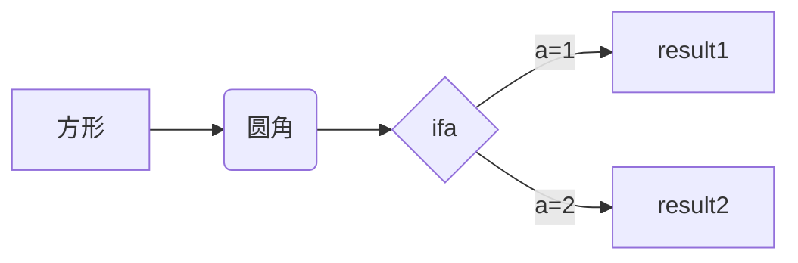
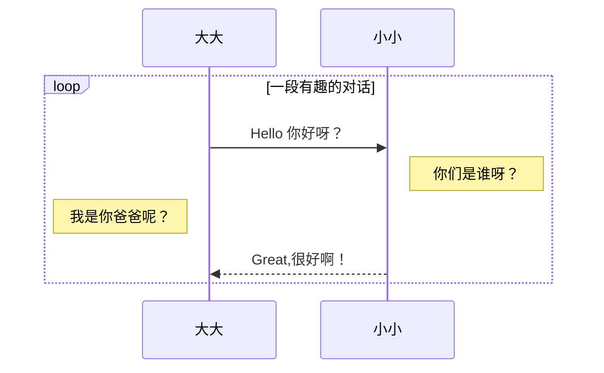
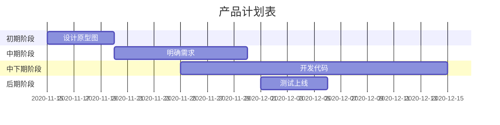

# Typora 的常见用法-Mac OS


> MarkDown 原文和效果切换快捷键：Commond + /

### 一、使用 Commond + 数字(1/2/3/4/5/6)可以输出对于层级的标题，如下(六级)：

```
# 一级标题       command + 1
## 二级标题      command + 2
### 三级标题     command + 3
#### 四级标题    command + 4
##### 五级标题   command + 5
###### 六级标题  command + 6
```

### 二、加粗：

**这是加粗**   【使用 Commond + B 快捷键】

### 三、斜体：

*这是斜体*   【使用 Commond + I 快捷键】

### 四、下划线：

<u>这是下划线</u>  【使用 Commond + U 快捷键】

### 五、引用：

【使用 Commond + option + Q 快捷键】或者输入符号 > + 空格

> 这是引用部分

> 这是使用的 > + 空格生成

### 六、删除线：

~~这是删除线~~  【格式：~~ + 内容 + ~~】

### 七、高亮

==这是高亮部分哦==  【高亮内容前后双等号，如：`==这是内容==` 】

### 八、分割线：

【使用 *** + 回车】或者【使用 --- + 回车】或者【使用 ___ + 回车】

***

---

___

### 九、其他快捷键：

选中一行：【Commond + L】

选中单词：【Commond + D】

选中相同格式的文字：【Commond + E】

查找：【Commond + F】

替换：【Commond + option + F】

### 十、无序列表：

【星号(*) + 内容，可按 Tab 键增加层级】或者【按 Commond + option + U 快捷键也可生成无序列表】

* A
* B
   * C
   * D
      * E
      * F
         * G

### 十一、有序列表：

【数字(1) + 空格 + 内容，可按 Tab 键增加层级】或者【按 Commond + option + O 快捷键也可生成有序列表】

1. A
2. B
    1. C
    2. D
        1. E
        2. F
            1. G

### 十二、代码块(单行/多行)：

单行代码使用这个符号： `  或者 ``

`String a = "Hello!"`

多行代码使用这个符号：``` + 回车 或者【使用快捷键： Commond + option + C】或者【使用 ~~~ + 回车 】

```java
public static void main(String[] args) {
        String a = "Hello~";  
}
```

指定代码块语言：【使用 ~~~ + 语言 + 回车】

```sql
SELECT * FROM Temp_Table WHERE id = 1 AND name = 'ABC';
```

### 十三、表格：

使用【 |列1|列2|列3|...| + 回车 】即可出现表格，如下：

| 列1     | 列2     | 列3     |
| ------ |:------:| ------:|
| Value1 | Value2 | Value3 |

或者使用快捷键【Commond + option + T】生成表格：

|     |     |     |
| --- | --- | --- |
|     |     |     |
|     |     |     |
|     |     |     |

### 十四、链接🔗或插入图片链接

如：[HYBlogs](https://www.hyblogs.com)

格式：【中括号 [ + 显示链接内容 + ] + ( + 链接地址 + ) 即可】 或者使用快捷键【Commond + K】

图片： 格式：感叹号 ! + 中括号 [ + 显示链接内容 + ] + ( + 链接地址 + ) 即可


### 十五、生成目录

使用快捷键：【中括号 [ + TOC + ] + 回车】

### 十六、代办事项：

- [x] 已完成
- [ ] 未完成
- [ ] 待完成
- [x] 未完待续...

语法格式：【 - + 空格 + [ + 字母x + ] + 内容】

### 十七、流程图

使用方式：

\```mermaid + 回车 

graph LR 横向流程图 

graph TD 竖向流程图

```
graph LR
A[方形] --> B(圆角)
B --> C{ifa}
C --> |a=1| D[result1]
C --> |a=2| E[result2]
```



### 十八、UML时序图：

使用方式：

\```mermaid + 回车

sequenceDiagram



### 十九、甘特图：

使用方式：

\```mermaid + 回车

Gantt



### 二十、数学表达式

快捷键【输入$$ + 回车】或者【command+option+B】
$$
P_{u,i}=\frac{\sum_{j}^n(sum{_{u,j}})*R_{j,i}}{\sum_{j}^nsim_{u,j}}
$$

### 二十一、特殊字符：

```
©     版权
×    乘号
÷   除号
±   加减号
<       小于号
>       大于号
≠       不等号
≤       小于等于
≥       大于等于
      空格
&      与
"     双引号
&apos;     单引号
```

&copy;     版权
&times;    乘号
&divide;   除号
&plusmn;   加减号
&lt;       小于号
&gt;       大于号
&ne;       不等号
&le;       小于等于
&ge;       大于等于
&nbsp;     空格
&amp;      与
&quot;     双引号
&apos;     单引号

### 二十二、注脚：

#### 上注脚：

HYBlogs[^1]

[^1]: https://www.hyblogs.com

CLLBlogs[^2]

[^2]: https://www.cllblogs.cn

HY_&&_CLL[^3]

[^3]: 这是HY和CLL

格式：

1、内容 + [ + ^ + 数字 + ] 

2、[ + ^ + 对于上面1中的数字 + ] + 冒号 : + 注脚内容

#### 下注脚：

用法：`~ + 下注脚内容 + ~`即可，如下所示：

H~2~O
